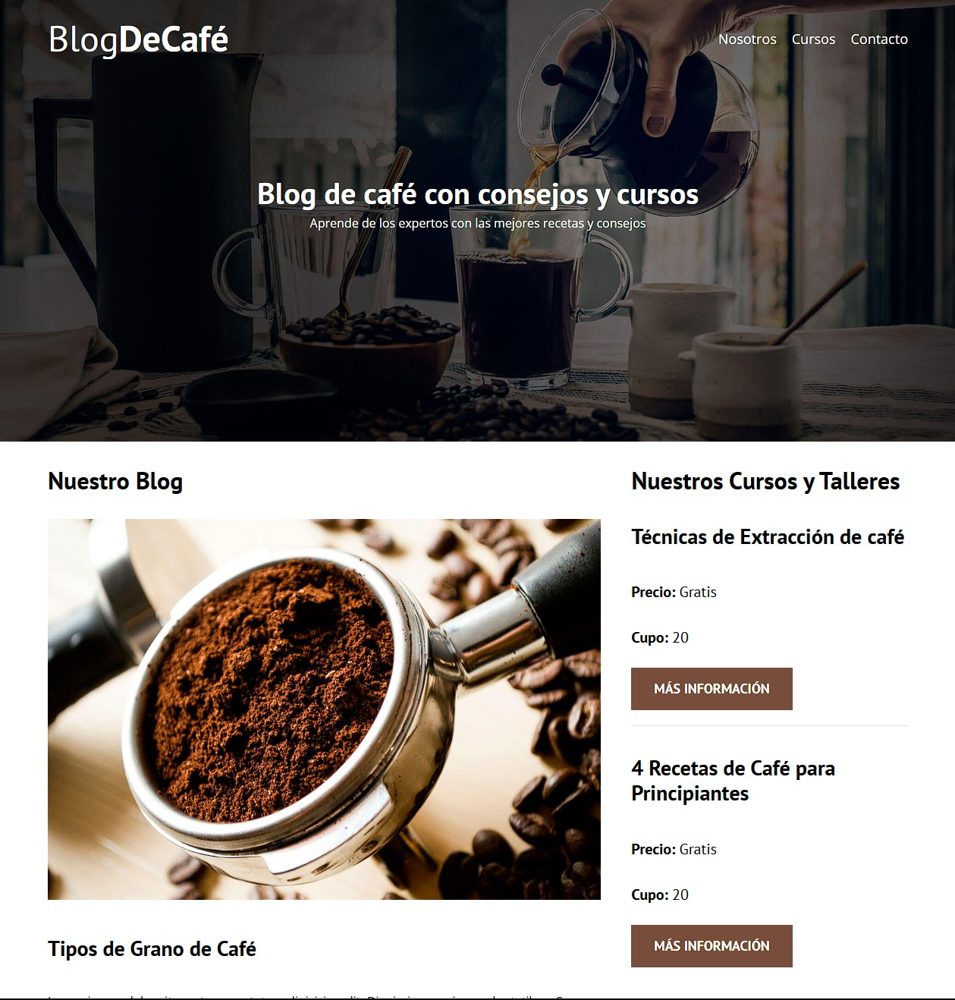

# BlogDeCafé
Un diseño de interfaz simple para un blog relacionado con cursos y preparación de café 100% responsivo. desarrollado con HTML y CSS puro.

## Tecnologías utilizadas
- **HTML5**: Estructura del contenido
- **CSS3**: Estilos y diseño responsivo

## Enlace
https://blogdecafeleonginel.netlify.app

## Capturas de Pantalla

